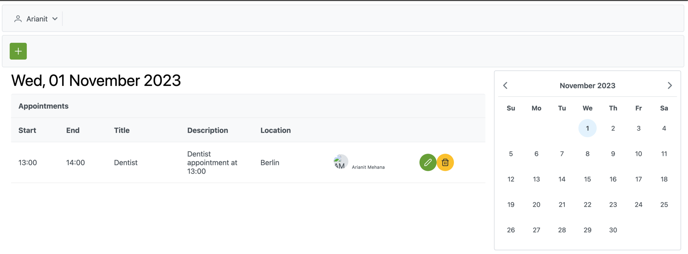
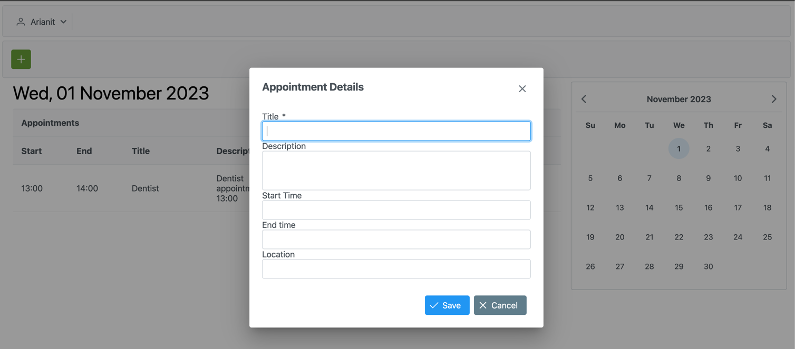

# Our Schedule

Our Schedule is a calendar application designed for couples or groups who want to share and manage their schedules
together. It provides an intuitive interface for creating, viewing, and sharing events, making collaborative planning
easy and efficient.

## Screenshots

Below are some screenshots showcasing the main features and user interface of Our Schedule:


*Login screen for user authentication.*


*Main calendar view for shared scheduling.*


*Dialog for creating a new appointment.*

## Architecture

The project is split into two independent services:

- **Backend (rest-schedule)**: Built with Java EE and runs on Quarkus. It exposes RESTful APIs for managing calendar
  data, users, and events.
- **Frontend (ui-schedule)**: Developed using PrimeFaces (JavaServer Faces) and also runs on Quarkus. It provides a
  user-friendly web interface for interacting with the calendar.

Both services can be run and deployed independently, allowing for flexible development and scaling.

## Features

- Shared calendar for couples or groups
- Event creation, editing, and deletion
- User management
- Responsive and interactive UI with PrimeFaces
- RESTful API for integration and automation

## Getting Started

### Prerequisites

- Java 11 or newer
- Maven
- Quarkus CLI (optional)

### Running the Backend

1. Navigate to the `rest-schedule` directory:
   ```bash
   cd rest-schedule
   ```
2. Start the backend service:
   ```bash
   ./mvnw quarkus:dev
   ```

### Running the Frontend

1. Navigate to the `ui-schedule` directory:
   ```bash
   cd ui-schedule
   ```
2. Start the frontend service:
   ```bash
   ./mvnw quarkus:dev
   ```

## Folder Structure

- `rest-schedule/` - Backend service (Java EE, Quarkus)
- `ui-schedule/` - Frontend service (PrimeFaces, Quarkus)

## Contributing

Contributions are welcome! Please open issues or submit pull requests for improvements.

## License

This project is licensed under the MIT License.
